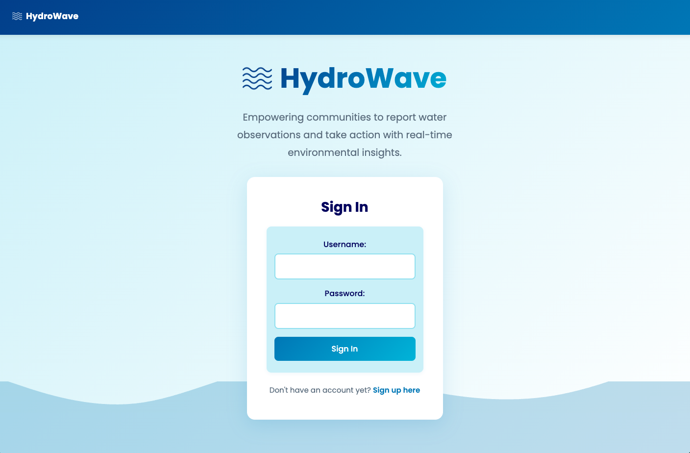
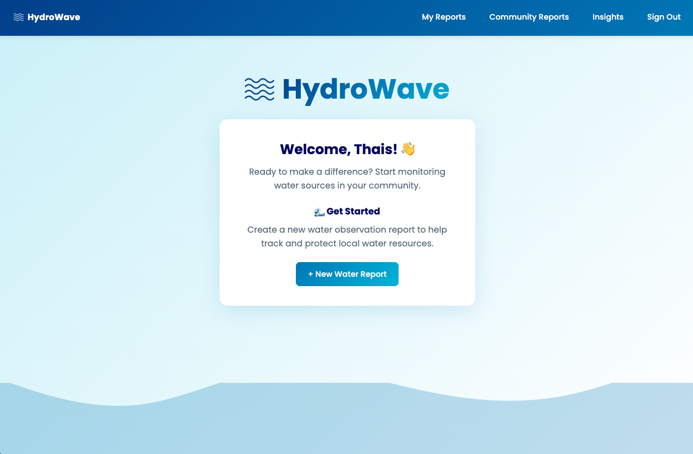
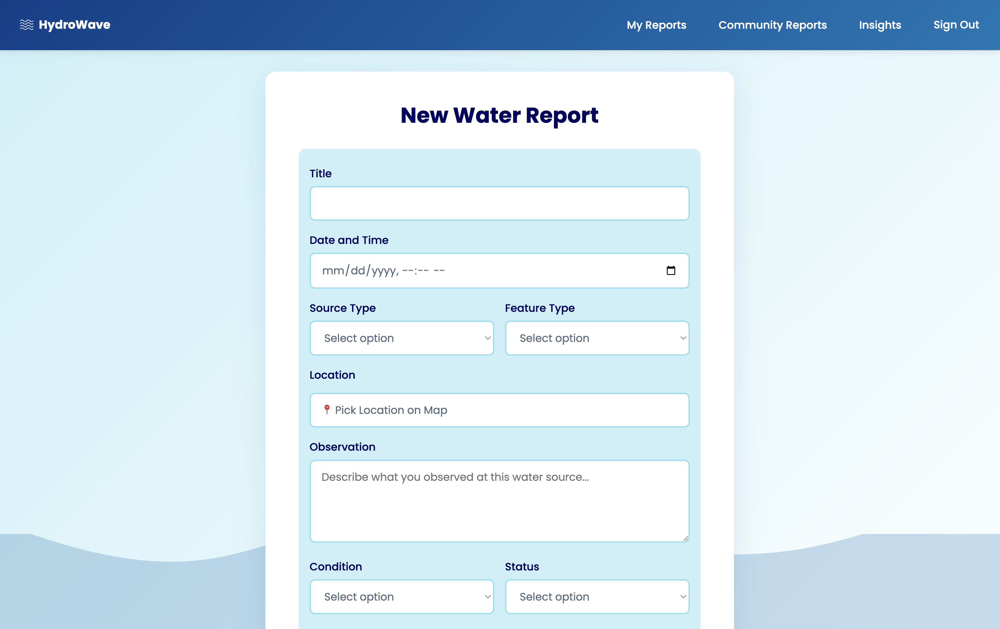
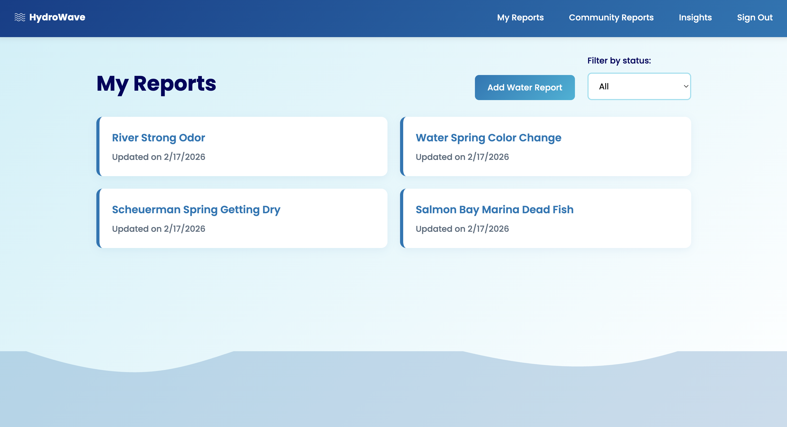
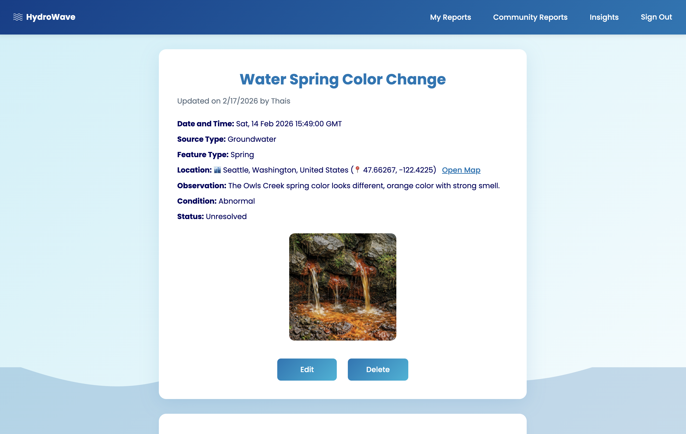
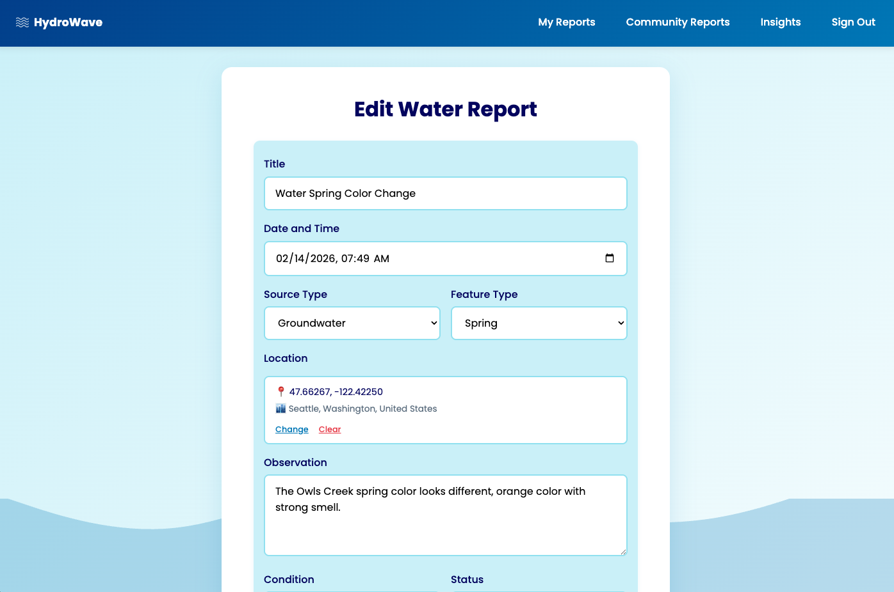
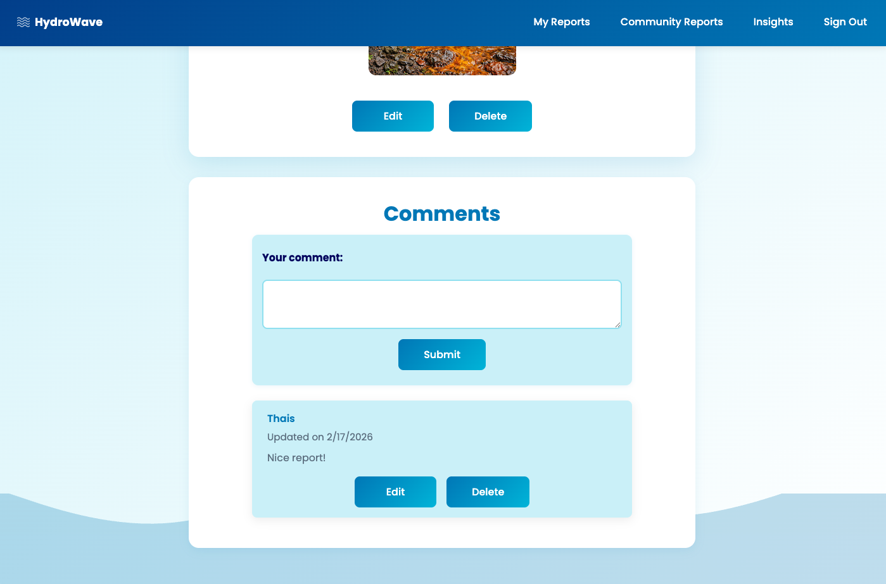
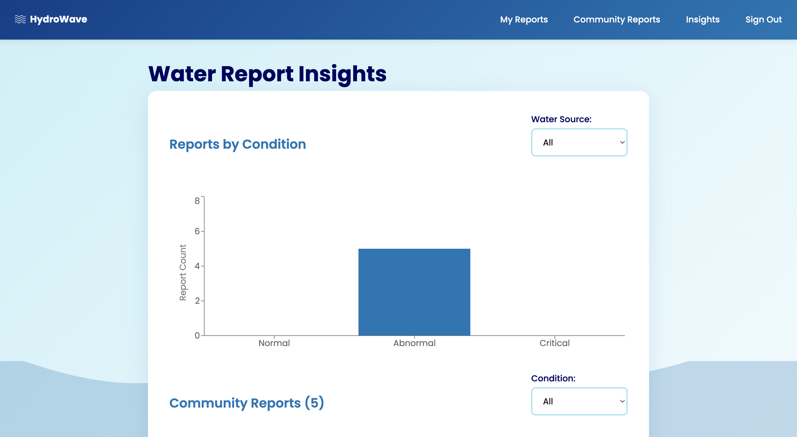
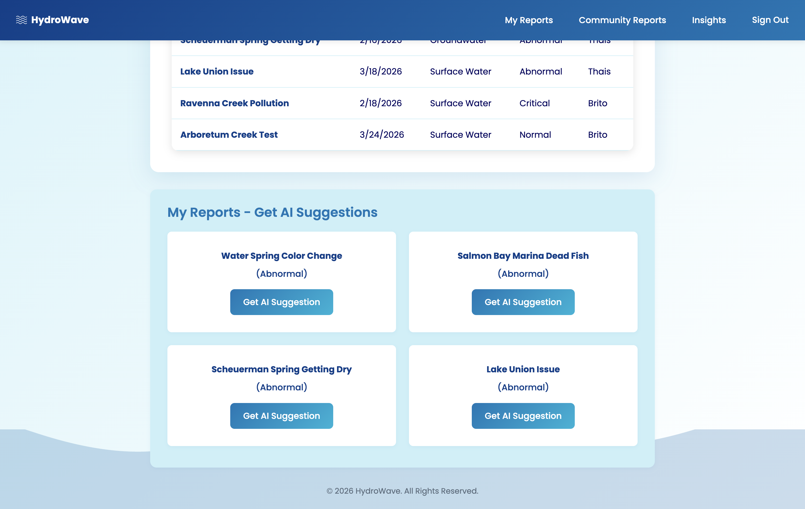

# :ocean: HydroWave 

## :spiral_notepad: Website Description

**HydroWaves** is a full-stack web application that empowers users to report water observations in their community or wherever they travel. The platform allows users to create water observation reports by adding description, condtition, status, uploading photos, and pinpointing exact locations on an interactive map. Users can explore the community page to view reports from others, interact through comments, and engage in collaborative environmental reporting. The `Insights` page provides visual analytics, including a bar chart and a table filtered by water source and condition, respectively, along with AI-powered recommendations, enabling users to take informed actions that support environmental awareness and preservation.

Whether tracking a single water source or participating in broader community observations, the platform encourages proactive stewardship of local ecosystems through an intuitive, interactive interface.

> **Why this platform?** With a background in hydrogeology and water resources, I wanted to create a platform that connects people with the state of their local water sources. Instead of building a technical tool for specialists, HydroWave was designed to be intuitive and accessible, allowing anyone to report observations, share insights, and engage with the community. By empowering everyday users to contribute, the platform encourages collective awareness and action on a wide range of water-related issues, from environmental concerns to community stewardship.

## :rocket: Getting Started

1. **Click the links below**:
* Planning Materials: [Trello](https://trello.com/b/9P7nSFS4/project-4)
* Back-end Repository: [hydro-wave-back-end](https://github.com/thaispbrito/hydro-wave-back-end)
* Deployed Website: [HydroWave](https://hydrowave.netlify.app)

2. **Sign Up or Sign In**: Create an account or log in to start using HydroWave!

3. **Add a Water Report**: Submit a report by adding your observations and completing any additional relevant fields.

4. **Add a Comment**: Engage with the community by commenting on other users’ water reports to share insights and feedback.

5. **Update and Delete a Water Report or Comment**: Edit or remove your reports and comments at any time to keep information accurate and up to date.

6. **Filter Water Reports by State**: Use filters on the `Community Reports` and `My Reports` pages to view reports by status (e.g., normal, abnormal, critical).

7. **Viw Water Report Chart + Table**: On the Insights page, explore a bar chart and a table showing reports filtered by water source and condition.

8. **Get AI Insights**: Receive AI-powered suggestions on next steps based on your reports to guide your environmental actions.

## :framed_picture: Screenshots 

| <h3>Description</h3>       | <h3>Screenshot<h3> |
| :----------------:| :------:   |
| <h3 align="center">Landing Page</h3>     |      |
| <h3 align="center">Home Page</h3>      |      |
| <h3 align="center">Add Report</h3>       |     |
| <h3 align="center">Report List </h3>    |     |
| <h3 align="center">Report Detailss </h3>   |  |
| <h3 align="center">Update Report </h3>   |  |
| <h3 align="center">Comment Section </h3>   |  |
| <h3 align="center">Insights</h3>  |  |
| <h3 align="center">AI Suggestions</h3>  |  |

## :desktop_computer: Technologies Used 

-05122A?logo=react)

## :globe_with_meridians: External Resources and Attributions

* [Recharts Documentation](https://recharts.github.io/)
* [Leaflet Documentation](https://leafletjs.com/reference.html)
* [Nominatim (OpenStreetMap)](https://nominatim.openstreetmap.org/)
* [Cloudinary](https://cloudinary.com/)
* [Gemini API](https://aistudio.google.com)
* [W3Schools](https://www.w3schools.com/) 
* [Freepik](https://www.freepik.com/icon/waves_10311026) (Wave icon by Muhammad Atif)

## :arrow_right: Next Steps 

* Add additional charts to enhance data visualization and provide deeper insights on the Insights page.
* Integrate the National Weather Service (NWS) API to display real-time weather alerts, such as flood warnings.
* Integrate the USGS Water Data APIs to build an educational page featuring real-world water monitoring data for users.
* Expand AI-powered features using the Gemini API, such as location-aware insights and contextual grounding with Google Maps.
* Improve responsive design to ensure a seamless experience across different screen sizes and devices.